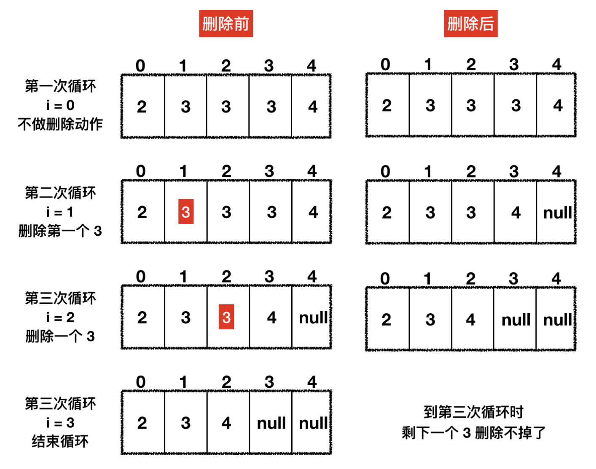

记录下来自己面试的一些问题和经验，期望以后能帮到别人。

[TOC]


# Java篇

### 谈谈你对Java平台的理解

说出Java的平台无关性，引出JVM虚拟机，JVM的好处和带来的内存管理问题，以及GC机制，Java内存结构

面向对象编程，从封装，继承，多态，反射，Java提供了丰富的类库，IO/NIO，网络，utils，更广阔的还有Java生态，广泛的应用场景。

### 八种基本数据类型的大小，以及他们的封装类


| 基本类型 | 大小（字节） | 默认值       | 封装类    |
| -------- | ------------ | ------------ | --------- |
| byte     | 1            | (byte)0      | Byte      |
| short    | 2            | (short)0     | Short     |
| int      | 4            | 0            | Integer   |
| long     | 8            | 0L           | Long      |
| float    | 4            | 0.0f         | Float     |
| double   | 8            | 0.0d         | Double    |
| boolean  | -            | false        | Boolean   |
| char     | 2            | \u0000(null) | Character |

   ### 重载和重写的区别

   **重写(Override)**

   从字面上看，重写就是 重新写一遍的意思。其实就是在子类中把父类本身有的方法重新写一遍。子类继承了父类原有的方法，但有时子类并不想原封不动的继承父类中的某个方法，所以在方法名，参数列表，返回类型(除过子类中方法的返回值是父类中方法返回值的子类时)都相同的情况下， 对方法体进行修改或重写，这就是重写。但要注意子类函数的访问修饰权限不能少于父类的。
   1.发生在父类与子类之间
   2.方法名，参数列表，返回类型（除过子类中方法的返回类型是父类中返回类型的子类）必须相同
   3.访问修饰符的限制一定要大于被重写方法的访问修饰符（public>protected>default>private)
   4.重写方法一定不能抛出新的检查异常或者比被重写方法申明更加宽泛的检查型异常

   **重载（Overload）**

   在一个类中，同名的方法如果有不同的参数列表（**参数类型不同、参数个数不同甚至是参数顺序不同**）则视为重载。同时，重载对返回类型没有要求，可以相同也可以不同，但**不能通过返回类型是否相同来判断重载**。 

   1.重载Overload是一个类中多态性的一种表现
   2.重载要求同名方法的参数列表不同(参数类型，参数个数甚至是参数顺序)
   3.重载的时候，返回值类型可以相同也可以不相同。无法以返回型别作为重载函数的区分标准 

   ### equals与==的区别

   == 比较的是变量(栈)内存中存放的对象的(堆)内存地址，用来判断两个对象的地址是否相同，即是否是指相同一个对象。比较的是真正意义上的指针操作。

   1、比较的是操作符两端的操作数是否是同一个对象。
   2、两边的操作数必须是同一类型的（可以是父子类之间）才能编译通过。
   3、比较的是地址，如果是具体的阿拉伯数字的比较，值相等则为true，如：
   int a=10 与 long b=10L 与 double c=10.0都是相同的（为true），因为他们都指向地址为10的堆。 

   **equals**：

   equals用来比较的是两个对象的内容是否相等，由于所有的类都是继承自java.lang.Object类的，所以适用于所有对象，如果没有对该方法进行覆盖的话，调用的仍然是Object类中的方法，而Object中的equals方法返回的却是==的判断。

   总结：

   所有比较是否相等时，都是用equals 并且在对常量相比较时，把常量写在前面，因为使用object的equals  object可能为null  则空指针，在阿里的代码规范中只使用equals ，阿里插件默认会识别，并可以快速修改，推荐安装阿里插件来排查老代码使用“==”，替换成equals

   ### String、String StringBuffer 和 StringBuilder 的区别是什么?  

1. String 被 final 修饰，说明 String 类绝不可能被继承了，也就是说任何对 String 的操作方法，都不会被继承覆写；
2. String 中保存数据的是一个 char 的数组 value。我们发现 value 也是被 final 修饰的，也就是说 value 一旦被赋值，内存地址是绝对无法修改的，而且 value 的权限是 private 的，外部绝对访问不到，String 也没有开放出可以对 value 进行赋值的方法，所以说 value 一旦产生，内存地址就根本无法被修改。

   ```java
public final class String
    implements java.io.Serializable, Comparable<String>, CharSequence {
    /** The value is used for character storage. */
    private final char value[];
}   
   ```

   每次+操作 ： 隐式在堆上new了一个跟原字符串相同的StringBuilder对象，再调用append方法 拼接+后面的字符。

   StringBuffer和StringBuilder他们两都继承了AbstractStringBuilder抽象类，从AbstractStringBuilder抽象类中我们可以看到 

   ```java
char[] value;
   ```

他们的底层都是可变的字符数组，所以在进行频繁的字符串操作时，建议使用StringBuffer和StringBuilder来进行操作。 另外StringBuffer 对方法加了同步锁或者对调用的方法加了同步锁，所以是线程安全的。StringBuilder 并没有对方法进行加同步锁，所以是非线程安全的。 

###  static

static 只能修饰类变量、方法和方法块。是静态的、全局的，一旦被修饰，说明被修饰的东西在一定范围内是共享的，谁都可以访问，这时候需要注意并发读写的问题。

**当 static 修饰类变量时**，如果该变量是 public 的话，表示该变量任何类都可以直接访问，而且无需初始化类，直接使用 **类名.static 变量** 这种形式访问即可。

这时候我们非常需要注意的一点就是线程安全的问题了，因为当多个线程同时对共享变量进行读写时，很有可能会出现并发问题，如我们定义了：`public static List<String> list = new ArrayList();`这样的共享变量。这个 list 如果同时被多个线程访问的话，就有线程安全的问题，这时候一般有两个解决办法：

1. 把线程不安全的 ArrayList 换成 线程安全的 CopyOnWriteArrayList；
2. 每次访问时，手动加锁。

所以在使用 static 修饰类变量时，如何保证线程安全是我们常常需要考虑的。

**当 static 修饰方法时**，代表该方法和当前类是无关的，任意类都可以直接访问（如果权限是 public 的话）。

有一点需要注意的是，该方法内部只能调用同样被 static 修饰的方法，不能调用普通方法，我们常用的 util 类里面的各种方法，我们比较喜欢用 static 修饰方法，好处就是调用特别方便。

static 方法内部的变量在执行时是没有线程安全问题的。方法执行时，数据运行在栈里面，栈的数据每个线程都是隔离开的，所以不会有线程安全的问题，所以 util 类的各个 static 方法，我们是可以放心使用的。

**当 static 修饰方法块时**，我们叫做静态块，静态块常常用于在类启动之前，初始化一些值，比如：

```java
public static List<String> list = new ArrayList();
// 进行一些初始化的工作
static {
    list.add("1");
}
```

静态块只能调用同样被 static 修饰的变量，并且 static 的变量需要写在静态块的前面，不然编译也会报错。

从结果中，我们可以看出两点：

1. 父类的静态变量和静态块比子类优先初始化；
2. 静态变量和静态块比类构造器优先初始化。

被 static 修饰的方法，在类初始化的时候并不会初始化，只有当自己被调用时，才会被执行。

### 如何证明 static 静态变量和类无关？

从三个方面就可以看出静态变量和类无关。

1. 我们不需要初始化类就可直接使用静态变量；
2. 我们在类中写个 main 方法运行，即便不写初始化类的代码，静态变量都会自动初始化；
3. 静态变量只会初始化一次，初始化完成之后，不管我再 new 多少个类出来，静态变量都不会再初始化了。

不仅仅是静态变量，静态方法块也和类无关。

### 常常看见变量和方法被 static 和 final 两个关键字修饰，为什么这么做？

1. 变量和方法于类无关，可以直接使用，使用比较方便；
2. 强调变量内存地址不可变，方法不可继承覆写，强调了方法内部的稳定性。

### final

final 的意思是不变的，一般来说用于以下三种场景：

1. 被 final 修饰的类，表明该类是无法继承的；
2. 被 final 修饰的方法，表明该方法是无法覆写的；
3. 被 final 修饰的变量，说明该变量在声明的时候，就必须初始化完成，而且以后也不能修改其内存地址。

第三点注意下，我们说的是无法修改其内存地址，并没有说无法修改其值。因为对于 List、Map 这些集合类来说，被 final 修饰后，是可以修改其内部值的，但却无法修改其初始化时的内存地址。

###  Long 的缓存问题

Long 自己实现了一种缓存机制，缓存了从 -128 到 127 内的所有 Long 值，如果是这个范围内的 Long 值，就不会初始化，而是从缓存中拿，缓存初始化源码如下：

```java
private static class LongCache {
    private LongCache(){}
    // 缓存，范围从 -128 到 127，+1 是因为有个 0
    static final Long cache[] = new Long[-(-128) + 127 + 1];

    // 容器初始化时，进行加载
    static {
        // 缓存 Long 值，注意这里是 i - 128 ，所以再拿的时候就需要 + 128
        for(int i = 0; i < cache.length; i++)
            cache[i] = new Long(i - 128);
    }
}
```

   ### Hash冲突时的解决办法

   有可能.在产生hash冲突时,两个不相等的对象就会有相同的 hashcode 值.当hash冲突产生时,一般有以下几种方式来处理:

   - 拉链法:每个哈希表节点都有一个next指针,多个哈希表节点可以用next指针构成一个单向链表，被分配到同一个索引上的多个节点可以用这个单向链表进行存储.
   - 开放定址法:一旦发生了冲突,就去寻找下一个空的散列地址,只要散列表足够大,空的散列地址总能找到,并将记录存入
   - 再哈希:又叫双哈希法,有多个不同的Hash函数.当发生冲突时,使用第二个,第三个….等哈希函数计算地址,直到无冲突.


#### 数组初始化，被加入一个值后，如果我使用 addAll 方法，一下子加入 15 个值，那么最终数组的大小是多少？

第一题中我们已经计算出来数组在加入一个值后，实际大小是 1，最大可用大小是 10 ，现在需要一下子加入 15 个值，那我们期望数组的大小值就是 16，此时数组最大可用大小只有 10，明显不够，需要扩容，扩容后的大小是：10 + 10 ／2 = 15，这时候发现扩容后的大小仍然不到我们期望的值 16，这时候源码中有一种策略如下：

```java
// newCapacity 本次扩容的大小，minCapacity 我们期望的数组最小大小
// 如果扩容后的值 < 我们的期望值，我们的期望值就等于本次扩容的大小
if (newCapacity - minCapacity < 0)
    newCapacity = minCapacity;
```

### ArrayList源码扩容过程有什么值得借鉴的地方？

- 扩容的思想值得学习，通过自动扩容的方式，让使用者不用关心底层数据结构的变化，封装得很好，1.5 倍的扩容速度，可以让扩容速度在前期缓慢上升，在后期增速较快，大部分工作中要求数组的值并不是很大，所以前期增长缓慢有利于节省资源，在后期增速较快时，也可快速扩容。
- 扩容过程中，有数组大小溢出的意识，比如要求扩容后的数组大小，不能小于 0，不能大于 Integer 的最大值。

### ArrayList 和 LinkedList 两者有没有最大容量

答：ArrayList 有最大容量的，为 Integer 的最大值，大于这个值 JVM 是不会为数组分配内存空间的，LinkedList 底层是双向链表，理论上可以无限大。但源码中，LinkedList 实际大小用的是 int 类型，这也说明了 LinkedList 不能超过 Integer 的最大值，不然会溢出。

### ArrayList 和 LinkedList 是如何对 null 值进行处理的

答：ArrayList 允许 null 值新增，也允许 null 值删除。删除 null 值时，是从头开始，找到第一值是 null 的元素删除；LinkedList 新增删除时对 null 值没有特殊校验，是允许新增和删除的。

#### ArrayList 和 LinedList 是线程安全的么，为什么？

答：当两者作为非共享变量时，比如说仅仅是在方法里面的局部变量时，是没有线程安全问题的，只有当两者是共享变量时，才会有线程安全问题。主要的问题点在于多线程环境下，所有线程任何时刻都可对数组和链表进行操作，这会导致值被覆盖，甚至混乱的情况。

如果有线程安全问题，在迭代的过程中，会频繁报 ConcurrentModificationException 的错误，意思是在我当前循环的过程中，数组或链表的结构被其它线程修改了。

### 删除类问题

#### 1 有一个 ArrayList，数据是 2、3、3、3、4，中间有三个 3，现在我通过 for (int i=0;i<list.size ();i++) 的方式，想把值是 3 的元素删除，请问可以删除干净么？最终删除的结果是什么，为什么？删除代码如下：

```java
List<String> list = new ArrayList<String>() {{
  add("2");
  add("3");
  add("3");
  add("3");
  add("4");
}};
for (int i = 0; i < list.size(); i++) {
  if (list.get(i).equals("3")) {
    list.remove(i);
  }
}
```

不能删除干净，最终删除的结果是 2、3、4，有一个 3 删除不掉，原因我们看下图：



从图中我们可以看到，每次删除一个元素后，该元素后面的元素就会往前移动，而此时循环的 i 在不断地增长，最终会使每次删除 3 的后一个 3 被遗漏，导致删除不掉。

#### 2 还是上面的 ArrayList 数组，我们通过增强 for 循环进行删除，可以么？

不可以，会报错。因为增强 for 循环过程其实调用的就是迭代器的 next () 方法，当你调用 list#remove () 方法进行删除时，modCount 的值会 +1，而这时候迭代器中的 expectedModCount 的值却没有变，导致在迭代器下次执行 next () 方法时，expectedModCount != modCount 就会报 ConcurrentModificationException 的错误。

#### 3 还是上面的数组，如果删除时使用 Iterator.remove () 方法可以删除么，为什么？

可以的，因为 Iterator.remove () 方法在执行的过程中，会把最新的 modCount 赋值给 expectedModCount，这样在下次循环过程中，modCount 和 expectedModCount 两者就会相等。

#### 4 以上三个问题对于 LinkedList 也是同样的结果么？

是的，虽然 LinkedList 底层结构是双向链表，但对于上述三个问题，结果和 ArrayList 是一致的。

### 工具类通用的特征

再看细节之前，我们先总结一下好的工具类都有哪些通用的特征写法：

1. 构造器必须是私有的。这样的话，工具类就无法被 new 出来，因为工具类在使用的时候，无需初始化，直接使用即可，所以不会开放出构造器出来。
2. 工具类的工具方法必须被 static、final 关键字修饰。这样的话就可以保证方法不可变，并且可以直接使用，非常方便。

我们需要注意的是，尽量不在工具方法中，对共享变量有做修改的操作访问（如果必须要做的话，必须加锁），因为会有线程安全的问题。除此之外，工具类方法本身是没有线程安全问题的，可以放心使用。

   ### Java创建对象有几种方式？

   java中提供了以下四种创建对象的方式:

   - new创建新对象
   - 通过反射机制
   - 采用clone机制
   - 通过序列化机制

   ### 泛型常用特点 

   泛型是Java SE 1.5之后的特性， 《Java 核心技术》中对泛型的定义是： 

   > “泛型” 意味着编写的代码可以被不同类型的对象所重用。 

“泛型”，顾名思义，“泛指的类型”。我们提供了泛指的概念，但具体执行的时候却可以有具体的规则来约束，比如我们用的非常多的ArrayList就是个泛型类，ArrayList作为集合可以存放各种元素，如Integer, String，自定义的各种类型等，但在我们使用的时候通过具体的规则来约束，如我们可以约束集合中只存放Integer类型的元素，如 

   ```java
   List<Integer> iniData = new ArrayList<>()
   ```

  使用泛型的好处？

以集合来举例，使用泛型的好处是我们不必因为添加元素类型的不同而定义不同类型的集合，如整型集合类，浮点型集合类，字符串集合类，我们可以定义一个集合来存放整型、浮点型，字符串型数据，而这并不是最重要的，因为我们只要把底层存储设置了Object即可，添加的数据全部都可向上转型为Object。 更重要的是我们可以通过规则按照自己的想法控制存储的数据类型。 

   ### 深拷贝和浅拷贝的区别是什么?

   - 浅拷贝:被复制对象的所有变量都含有与原来的对象相同的值,而所有的对其他对象的引用仍然指向原来的对象.换言之,浅拷贝仅仅复制所考虑的对象,而不复制它所引用的对象.
   - 深拷贝:被复制对象的所有变量都含有与原来的对象相同的值.而那些引用其他对象的变量将指向被复制过的新对象.而不再是原有的那些被引用的对象.换言之.深拷贝把要复制的对象所引用的对象都复制了一遍.

   ### a=a+b与a+=b有什么区别吗?

    `+=`操作符会进行隐式自动类型转换,此处a+=b隐式的将加操作的结果类型强制转换为持有结果的类型,而a=a+b则不会自动进行类型转换.如： 

   ```java
   byte a = 127;
   byte b = 127;
   b = a + b; // 报编译错误:cannot convert from int to byte
   b += a; 
   ```

   以下代码是否有错,有的话怎么改？

   ```java
   short s1= 1;
   s1 = s1 + 1;
   ```

    有错误.short类型在进行运算时会自动提升为int类型,也就是说`s1+1`的运算结果是int类型,而s1是short类型,此时编译器会报错. 

   正确写法：

   ```java
   short s1= 1; 
   s1 += 1; 
   ```

+=操作符会对右边的表达式结果强转匹配左边的数据类型,所以没错. 


   ### Java 序列化中如果有些字段不想进行序列化，怎么办？

   对于不想进行序列化的变量，使用 transient 关键字修饰。

   transient 关键字的作用是：阻止实例中那些用此关键字修饰的的变量序列化；当对象被反序列化时，被 transient 修饰的变量值不会被持久化和恢复。transient 只能修饰变量，不能修饰类和方法。

### 线程有哪些基本状态?


当线程执行 `wait()`方法之后，线程进入 **WAITING（等待）**状态。进入等待状态的线程需要依靠其他线程的通知才能够返回到运行状态，而 TIME_WAITING(超时等待) 状态相当于在等待状态的基础上增加了超时限制，比如通过 `sleep（long millis）`方法或 `wait（long millis）`方法可以将 Java 线程置于 TIMED WAITING 状态。当超时时间到达后 Java 线程将会返回到 RUNNABLE 状态。当线程调用同步方法时，在没有获取到锁的情况下，线程将会进入到 BLOCKED（阻塞） 状态。线程在执行 Runnable 的`run()`方法之后将会进入到 TERMINATED（终止） 状态。 

### Java反射的原理与作用

### 你有没有遇到过OutOfMemory问题？你是怎么来处理这个问题的？处理 过程中有哪些收获？

堆内存不足是最常见的 OOM 原因之一,抛出的错误信息是“java.lang.OutOfMemoryError:Java heap space”,原因可能千奇百怪,例如,可能存在内存泄漏问题;也很有可能就是堆的大小不合理,比如我们要处理比较可观的数据量,但是没有显式指定 JVM 堆大小或者指定数值偏小;或者出现 JVM 处理引用不及时,导致堆积起来,内存无法释放等。
而对于 Java 虚拟机栈和本地方法栈,这里要稍微复杂一点。如果我们写一段程序不断的进行递归调用,而且没有退出条件,就会导致不断地进行压栈。类似这种情况,JVM 实际会抛出 StackOverFlowError;当然,如果 JVM 试图去扩展栈空间的的时候失败,则会抛出 OutOfMemoryError。
对于老版本的 Oracle JDK,因为永久代的大小是有限的,并且 JVM 对永久代垃圾回收(如,常量池回收、卸载不再需要的类型)非常不积极,所以当我们不断添加新类型的时候,永久代出现 OutOfMemoryError 也非常多见,尤其是在运行时存在大量动态类型生成的场合;类似 Intern 字符串缓存占用太多空间,也会导致 OOM 问题。对应的异常信息,会标记出来和永久代相关:“java.lang.OutOfMemoryError: PermGen space”。
随着元数据区的引入,方法区内存已经不再那么窘迫,所以相应的 OOM 有所改观,出现 OOM,异常信息则变成了:“java.lang.OutOfMemoryError: Metaspace”。

## 集合类

### HashMap 底层数据结构

答：HashMap 底层是数组 + 链表 + 红黑树的数据结构，数组的主要作用是方便快速查找，时间复杂度是 O(1)，默认大小是 16，数组的下标索引是通过 key 的 hashcode 计算出来的，数组元素叫做 Node，当多个 key 的 hashcode 一致，但 key 值不同时，单个 Node 就会转化成链表，链表的查询复杂度是 O(n)，当链表的长度大于等于 8 并且数组的大小超过 64 时，链表就会转化成红黑树，红黑树的查询复杂度是 O(log(n))，简单来说，最坏的查询次数相当于红黑树的最大深度。

### 2.1 HashMap 是如何扩容的？

答：扩容的时机：

1. put 时，发现数组为空，进行初始化扩容，默认扩容大小为 16;
2. put 成功后，发现现有数组大小大于扩容的门阀值时，进行扩容，扩容为老数组大小的 2 倍;

扩容的门阀是 threshold，每次扩容时 threshold 都会被重新计算，门阀值等于数组的大小 * 影响因子（0.75）。

新数组初始化之后，需要将老数组的值拷贝到新数组上，链表和红黑树都有自己拷贝的方法。


### 2.2 hash 冲突时怎么办？

答：hash 冲突指的是 key 值的 hashcode 计算相同，但 key 值不同的情况。

如果桶中元素原本只有一个或已经是链表了，新增元素直接追加到链表尾部；

如果桶中元素已经是链表，并且链表个数大于等于 8 时，此时有两种情况：

1. 如果此时数组大小小于 64，数组再次扩容，链表不会转化成红黑树;
2. 如果数组大小大于 64 时，链表就会转化成红黑树。

这里不仅仅判断链表个数大于等于 8，还判断了数组大小，数组容量小于 64 没有立即转化的原因，猜测主要是因为红黑树占用的空间比链表大很多，转化也比较耗时，所以数组容量小的情况下冲突严重，我们可以先尝试扩容，看看能否通过扩容来解决冲突的问题。

### hashmap的数据结构和死锁的生成

HashMap 是我们经常会用到的集合类，JDK 1.7 之前底层使用了数组加链表的组合结构，新添加的元素通过取模的方式，定位 Table 数组位置，然后将元素加入链表头部，这样下次提取时就可以快速被访问到。访问数据时，也是通过取模的方式，定位数组中的位置，然后再遍历链表，依次比较，获取相应的元素。

如果 HasMap 中元素过多时，可能导致某个位置上链表很长。原本 O(1) 查找性能，可能就退化成 O(N),严重降低查找效率。为了避免这种情况，当 HasMap 元素数量满足以下条件时，将会自动扩容,重新分配元素。

```
// size:HashMap 中实际元素数量
//capacity：HashMap 容量，即 Table 数组长度，默认为：16
//loadFactor：负载因子，默认为：0.75
size>=capacity*loadFactor
```

HasMap 将会把容量扩充为原来的两倍，然后将原数组元素迁移至新数组。

 旧数组元素迁移到新数组时，依旧采用『头插入法』，这样将会导致新链表元素的逆序排序。

多线程并发扩容的情况下，链表可能形成死链（环形链表）。一旦有任何查找元素的动作，线程将会陷入死循环,从而引发 CPU 使用率飙升。

***\*1. JDK1.8 改进方案\****

JDK1.8 HashMap 底层结构进行彻底重构，使用数组加链表/红黑树方式这种组合结构。


新元素依旧通过取模方式获取 Table 数组位置，然后再将元素加入链表尾部。一旦链表元素数量超过 8 之后，自动转为红黑树，进一步提高了查找效率。

由于 JDK1.8 链表采用『尾插入』法，从而避免并发扩容情况下链表形成死链的可能。

### CopyOnWriteArrayList 通过哪些手段实现了线程安全？

1. 数组容器被 volatile 关键字修饰，保证了数组内存地址被任意线程修改后，都会通知到其他线程；
2. 对数组的所有修改操作，都进行了加锁，保证了同一时刻，只能有一个线程对数组进行修改，比如我在 add 时，就无法 remove；
3. 修改过程中对原数组进行了复制，是在新数组上进行修改的，修改过程中，不会对原数组产生任何影响。

###  CopyOnWriteArrayList在 add 方法中，对数组进行加锁后，不是已经是线程安全了么，为什么还需要对老数组进行拷贝？

答：的确，对数组进行加锁后，能够保证同一时刻，只有一个线程能对数组进行 add，在同单核 CPU 下的多线程环境下肯定没有问题，但我们现在的机器都是多核 CPU，如果我们不通过复制拷贝新建数组，修改原数组容器的内存地址的话，是无法触发 volatile 可见性效果的，那么其他 CPU 下的线程就无法感知数组原来已经被修改了，就会引发多核 CPU 下的线程安全问题。

假设我们不复制拷贝，而是在原来数组上直接修改值，数组的内存地址就不会变，而数组被 volatile 修饰时，必须当数组的内存地址变更时，才能及时的通知到其他线程，内存地址不变，仅仅是数组元素值发生变化时，是无法把数组元素值发生变动的事实，通知到其它线程的。

### CopyOnWriteArrayList 迭代过程中，数组结构变动，不会抛出ConcurrentModificationException 了

答：主要是因为 CopyOnWriteArrayList 每次操作时，都会产生新的数组，而迭代时，持有的仍然是老数组的引用，所以我们说的数组结构变动，是用新数组替换了老数组，老数组的结构并没有发生变化，所以不会抛出异常了。

### 插入的数据正好在 List 的中间，请问两种 List 分别拷贝数组几次？为什么？

答：ArrayList 只需拷贝一次，假设插入的位置是 2，只需要把位置 2 （包含 2）后面的数据都往后移动一位即可，所以拷贝一次。

CopyOnWriteArrayList 拷贝两次，因为 CopyOnWriteArrayList 多了把老数组的数据拷贝到新数组上这一步，可能有的同学会想到这种方式：先把老数组拷贝到新数组，再把 2 后面的数据往后移动一位，这的确是一种拷贝的方式，但 CopyOnWriteArrayList 底层实现更加灵活，而是：把老数组 0 到 2 的数据拷贝到新数组上，预留出新数组 2 的位置，再把老数组 3～ 最后的数据拷贝到新数组上，这种拷贝方式可以减少我们拷贝的数据，虽然是两次拷贝，但拷贝的数据却仍然是老数组的大小，设计的非常巧妙。

### ConcurrentHashMap 通过哪些手段保证了线程安全。

答：主要有以下几点：

1. 储存 Map 数据的数组被 volatile 关键字修饰，一旦被修改，立马就能通知其他线程，因为是数组，所以需要改变其内存值，才能真正的发挥出 volatile 的可见特性；
2. put 时，如果计算出来的数组下标索引没有值的话，采用无限 for 循环 + CAS 算法，来保证一定可以新增成功，又不会覆盖其他线程 put 进去的值；
3. 如果 put 的节点正好在扩容，会等待扩容完成之后，再进行 put ，保证了在扩容时，老数组的值不会发生变化；
4. 对数组的槽点进行操作时，会先锁住槽点，保证只有当前线程才能对槽点上的链表或红黑树进行操作；
5. 红黑树旋转时，会锁住根节点，保证旋转时的线程安全。

### CAS 算法在 ConcurrentHashMap 中的应用？

答：CAS 其实是一种乐观锁，一般有三个值，分别为：赋值对象，原值，新值，在执行的时候，会先判断内存中的值是否和原值相等，相等的话把新值赋值给对象，否则赋值失败，整个过程都是原子性操作，没有线程安全问题。

ConcurrentHashMap 的 put 方法中，有使用到 CAS ，是结合无限 for 循环一起使用的，步骤如下：

1. 计算出数组索引下标，拿出下标对应的原值；
2. CAS 覆盖当前下标的值，赋值时，如果发现内存值和 1 拿出来的原值相等，执行赋值，退出循环，否则不赋值，转到 3；
3. 进行下一次 for 循环，重复执行 1，2，直到成功为止。

### 两种 Map 扩容时，有啥区别？

答：区别很大，HashMap 是直接在老数据上面进行扩容，多线程环境下，会有线程安全的问题，而 ConcurrentHashMap 就不太一样，扩容过程是这样的：

1. 从数组的队尾开始拷贝；
2. 拷贝数组的槽点时，先把原数组槽点锁住，拷贝成功到新数组时，把原数组槽点赋值为转移节点；
3. 从数组的尾部拷贝到头部，每拷贝成功一次，就把原数组的槽点设置成转移节点；
4. 直到所有数组数据都拷贝到新数组时，直接把新数组整个赋值给数组容器，拷贝完成。

简单来说，通过扩容时给槽点加锁，和发现槽点正在扩容就等待的策略，保证了 ConcurrentHashMap 可以慢慢一个一个槽点的转移，保证了扩容时的线程安全，转移节点比较重要，平时问的人也比较多。

### 1.1 说说你对队列的理解，队列和集合的区别。

答：对队列的理解：

1. 首先队列本身也是个容器，底层也会有不同的数据结构，比如 LinkedBlockingQueue 是底层是链表结构，所以可以维持先入先出的顺序，比如 DelayQueue 底层可以是队列或堆栈，所以可以保证先入先出，或者先入后出的顺序等等，底层的数据结构不同，也造成了操作实现不同；
2. 部分队列（比如 LinkedBlockingQueue ）提供了暂时存储的功能，我们可以往队列里面放数据，同时也可以从队列里面拿数据，两者可以同时进行；
3. 队列把生产数据的一方和消费数据的一方进行解耦，生产者只管生产，消费者只管消费，两者之间没有必然联系，队列就像生产者和消费者之间的数据通道一样，如 LinkedBlockingQueue；
4. 队列还可以对消费者和生产者进行管理，比如队列满了，有生产者还在不停投递数据时，队列可以使生产者阻塞住，让其不再能投递，比如队列空时，有消费者过来拿数据时，队列可以让消费者 hodler 住，等有数据时，唤醒消费者，让消费者拿数据返回，如 ArrayBlockingQueue；
5. 队列还提供阻塞的功能，比如我们从队列拿数据，但队列中没有数据时，线程会一直阻塞到队列有数据可拿时才返回。

队列和集合的区别：

1. 和集合的相同点，队列（部分例外）和集合都提供了数据存储的功能，底层的储存数据结构是有些相似的，比如说 LinkedBlockingQueue 和 LinkedHashMap 底层都使用的是链表，ArrayBlockingQueue 和 ArrayList 底层使用的都是数组。

2. 和集合的区别：

   2.1 部分队列和部分集合底层的存储结构很相似的，但两者为了完成不同的事情，提供的 API 和其底层的操作实现是不同的。

   2.2 队列提供了阻塞的功能，能对消费者和生产者进行简单的管理，队列空时，会阻塞消费者，有其他线程进行 put 操作后，会唤醒阻塞的消费者，让消费者拿数据进行消费，队列满时亦然。

   2.3 解耦了生产者和消费者，队列就像是生产者和消费者之间的管道一样，生产者只管往里面丢，消费者只管不断消费，两者之间互不关心。


### 1.2 哪些队列具有阻塞的功能，大概是如何阻塞的？

答：队列主要提供了两种阻塞功能，如下：

1. LinkedBlockingQueue 链表阻塞队列和 ArrayBlockingQueue 数组阻塞队列是一类，前者容量是 Integer 的最大值，后者数组大小固定，两个阻塞队列都可以指定容量大小，当队列满时，如果有线程 put 数据，线程会阻塞住，直到有其他线程进行消费数据后，才会唤醒阻塞线程继续 put，当队列空时，如果有线程 take 数据，线程会阻塞到队列不空时，继续 take。
2. SynchronousQueue 同步队列，当线程 put 时，必须有对应线程把数据消费掉，put 线程才能返回，当线程 take 时，需要有对应线程进行 put 数据时，take 才能返回，反之则阻塞，举个例子，线程 A put 数据 A1 到队列中了，此时并没有任何的消费者，线程 A 就无法返回，会阻塞住，直到有线程消费掉数据 A1 时，线程 A 才能返回。


### 1.3 底层是如何实现阻塞的？

答：队列本身并没有实现阻塞的功能，而是利用 Condition 的等待唤醒机制，阻塞底层实现就是更改线程的状态为沉睡，细节我们在锁小节会说到。


### 1.4 LinkedBlockingQueue 和 ArrayBlockingQueue 有啥区别。

答：相同点：

1. 两者的阻塞机制大体相同，比如在队列满、空时，线程都会阻塞住。

不同点：

1. LinkedBlockingQueue 底层是链表结构，容量默认是 Interge 的最大值，ArrayBlockingQueue 底层是数组，容量必须在初始化时指定。
2. 两者的底层结构不同，所以 take、put、remove 的底层实现也就不同。


### 1.5 往队列里面 put 数据是线程安全的么？为什么？

答：是线程安全的，在 put 之前，队列会自动加锁，put 完成之后，锁会自动释放，保证了同一时刻只会有一个线程能操作队列的数据，以 LinkedBlockingQueue 为例子，put 时，会加 put 锁，并只对队尾 tail 进行操作，take 时，会加 take 锁，并只对队头 head 进行操作，remove 时，会同时加 put 和 take 锁，所以各种操作都是线程安全的，我们工作中可以放心使用。


### 1.6 take 的时候也会加锁么？既然 put 和 take 都会加锁，是不是同一时间只能运行其中一个方法。

答：1：是的，take 时也会加锁的，像 LinkedBlockingQueue 在执行 take 方法时，在拿数据的同时，会把当前数据删除掉，就改变了链表的数据结构，所以需要加锁来保证线程安全。

2：这个需要看情况而言，对于 LinkedBlockingQueue 来说，队列的 put 和 take 都会加锁，但两者的锁是不一样的，所以两者互不影响，可以同时进行的，对于 ArrayBlockingQueue 而言，put 和 take 是同一个锁，所以同一时刻只能运行一个方法。


### 1.7 工作中经常使用队列的 put、take 方法有什么危害，如何避免。

答：当队列满时，使用 put 方法，会一直阻塞到队列不满为止。

当队列空时，使用 take 方法，会一直阻塞到队列有数据为止。

两个方法都是无限（永远、没有超时时间的意思）阻塞的方法，容易使得线程全部都阻塞住，大流量时，导致机器无线程可用，所以建议在流量大时，使用 offer 和 poll 方法来代替两者，我们只需要设置好超时阻塞时间，这两个方法如果在超时时间外，还没有得到数据的话，就会返回默认值（LinkedBlockingQueue 为例），这样就不会导致流量大时，所有的线程都阻塞住了。

这个也是生产事故常常发生的原因之一，尝试用 put 和 take 方法，在平时自测中根本无法发现，对源码不熟悉的同学也不会意识到会有问题，当线上大流量打进来时，很有可能会发生故障，所以我们平时工作中使用队列时，需要谨慎再谨慎。


### 1.8 把数据放入队列中后，有木有办法让队列过一会儿再执行？

答：可以的，DelayQueue 提供了这种机制，可以设置一段时间之后再执行，该队列有个唯一的缺点，就是数据保存在内存中，在重启和断电的时候，数据容易丢失，所以定时的时间我们都不会设置很久，一般都是几秒内，如果定时的时间需要设置很久的话，可以考虑采取延迟队列中间件（这种中间件对数据会进行持久化，不怕断电的发生）进行实现。


### 1.9 DelayQueue 对元素有什么要求么，我把 String 放到队列中去可以么？

答：DelayQueue 要求元素必须实现 Delayed 接口，Delayed 本身又实现了 Comparable 接口，Delayed 接口的作用是定义还剩下多久就会超时，给使用者定制超时时间的，Comparable 接口主要用于对元素之间的超时时间进行排序的，两者结合，就可以让越快过期的元素能够排在前面。

所以把 String 放到 DelayQueue 中是不行的，编译都无法通过，DelayQueue 类在定义的时候，是有泛型定义的，泛型类型必须是 Delayed 接口的子类才行。


### 1.10 DelayQueue 如何让快过期的元素先执行的？

答：DelayQueue 中的元素都实现 Delayed 和 Comparable 接口的，其内部会使用 Comparable 的 compareTo 方法进行排序，我们可以利用这个功能，在 compareTo 方法中实现过期时间和当前时间的差，这样越快过期的元素，计算出来的差值就会越小，就会越先被执行。


### 1.11 如何查看 SynchronousQueue 队列的大小？

答：此题是个陷进题，题目首先设定了 SynchronousQueue 是可以查看大小的，实际上 SynchronousQueue 本身是没有容量的，所以也无法查看其容量的大小，其内部的 size 方法都是写死的返回 0。


### 1.12 SynchronousQueue 底层有几种数据结构，两者有何不同？

答：底层有两种数据结构，分别是队列和堆栈。

两者不同点：

1. 队列维护了先入先出的顺序，所以最先进去队列的元素会最先被消费，我们称为公平的，而堆栈则是先入后出的顺序，最先进入堆栈中的数据可能会最后才会被消费，我们称为不公平的。
2. 两者的数据结构不同，导致其 take 和 put 方法有所差别，具体的可以看 《 SynchronousQueue 源码解析 》章节。


### 1.13 假设 SynchronousQueue 底层使用的是堆栈，线程 1 执行 take 操作阻塞住了，然后有线程 2 执行 put 操作，问此时线程 2 是如何把 put 的数据传递给 take 的？

答：这是一个好问题，也是理解 SynchronousQueue 的核心问题。

首先线程 1 被阻塞住，此时堆栈头就是线程 1 了，此时线程 2 执行 put 操作，会把 put 的数据赋值给堆栈头的 match 属性，并唤醒线程 1，线程 1 被唤醒后，拿到堆栈头中的 match 属性，就能够拿到 put 的数据了。

严格上说并不是 put 操作直接把数据传递给了 take，而是 put 操作改变了堆栈头的数据，从而 take 可以从堆栈头上直接拿到数据，堆栈头是 take 和 put 操作之间的沟通媒介。


### 1.14 如果想使用固定大小的队列，有几种队列可以选择，有何不同？

答：可以使用 LinkedBlockingQueue 和 ArrayBlockingQueue 两种队列。

前者是链表，后者是数组，链表新增时，只要建立起新增数据和链尾数据之间的关联即可，数组新增时，需要考虑到索引的位置（takeIndex 和 putIndex 分别记录着下次拿数据、放数据的索引位置），如果增加到了数组最后一个位置，下次就要重头开始新增。


### 1.15 ArrayBlockingQueue 可以动态扩容么？用到数组最后一个位置时怎么办？

答：不可以的，虽然 ArrayBlockingQueue 底层是数组，但不能够动态扩容的。

假设 put 操作用到了数组的最后一个位置，那么下次 put 就需要从数组 0 的位置重新开始了。

假设 take 操作用到数组的最后一个位置，那么下次 take 的时候也会从数组 0 的位置重新开始。


### 1.16 ArrayBlockingQueue take 和 put 都是怎么找到索引位置的？是利用 hash 算法计算得到的么？

答：ArrayBlockingQueue 有两个属性，为 takeIndex 和 putIndex，分别标识下次 take 和 put 的位置，每次 take 和 put 完成之后，都会往后加一，虽然底层是数组，但和 HashMap 不同，并不是通过 hash 算法计算得到的。

### **SynchronizedMap**和**ConcurrentHashMap**

对于并发的情况，我们可以使用 JDK 提供 SynchronizedMap 保证安全。

SynchronizedMap 是一个内部类，只能通过以下方式创建实例。

Map m = Collections.synchronizedMap(**new** HashMap(...));

每个方法内将会使用 synchronized 关键字加锁，从而保证并发安全。

由于多线程共享同一把锁，导致同一时间只允许一个线程读写操作，其他线程必须等待，极大降低的性能。

并且大多数业务场景都是读多写少，多线程读操作本身并不冲突，SynchronizedMap 极大的限制读的性能。

所以多线程并发场景我们很少使用 SynchronizedMap。

**ConcurrentHashMap**

既然多线程共享一把锁，导致性能下降。那么设想一下我们是不是多搞几把锁，分流线程，减少锁冲突，提高并发度。

ConcurrentHashMap 正是使用这种方法，不但保证并发过程数据安全，又保证一定的效率。

**1. JDK1.7**

JDK1.7  ConcurrentHashMap 数据结构如下所示:


Segament 是一个ConcurrentHashMap内部类，底层结构与 HashMap 一致。另外Segament 继承自 ReentrantLock

当新元素加入 ConcurrentHashMap 时，首先根据 key hash 值找到相应的 Segament。接着直接对 Segament 上锁，若获取成功，后续操作步骤如同 HashMap。

由于锁的存在，Segament 内部操作都是并发安全，同时由于其他 Segament 未被占用，因此可以支持 concurrencyLevel 个线程安全的并发读写。

***\*size 统计问题\****

虽然 ConcurrentHashMap 引入分段锁解决多线程并发的问题，但是同时引入新的复杂度，导致计算 ConcurrentHashMap 元素数量将会变得复杂。

由于 ConcurrentHashMap 元素实际分布在 Segament 中，为了统计实际数量，只能遍历 Segament 数组求和。

为了数据的准确性，这个过程过我们需要锁住所有的 Segament，计算结束之后，再依次解锁。不过这样做，将会导致写操作被阻塞，一定程度降低 ConcurrentHashMap 性能。

所以这里对 ConcurrentHashMap#size 统计方法进行一定的优化。

Segment 每次被修改（写入，删除）,都会对 modCount（更新次数）加 1。只要相邻两次计算获取所有的 Segment modCount 总和一致，则代表两次计算过程并无写入或删除，可以直接返回统计数量。

如果三次计算结果都不一致，那没办法只能对所有 Segment 加锁，重新计算结果。

这里需要注意的是，这里求得 size 数量不能做到 100% 准确。这是因为最后依次对 Segment 解锁后，可能会有其他线程进入写入操作。这样就导致返回时的数量与实际数不一致。

不过这也能被接受，总不能因为为了统计元素停止所有元素的写入操作。

***\*性能问题\****

想象一种极端情况的，所有写入都落在同一个 Segment中，这就导致ConcurrentHashMap 退化成 SynchronizedMap，共同抢一把锁。

***\*2. JDK1.8 改进方案\****

JDK1.8 之后，ConcurrentHashMap 取消了分段锁的设计，进一步减少锁冲突的发生。另外也引入红黑树的结构，进一步提高查找效率。

数据结构如下所示：


Table 数组的中每一个 Node 我们都可以看做一把锁，这就避免了 Segament 退化问题。

另外一旦 ConcurrentHashMap 扩容， Table 数组元素变多，锁的数量也会变多，并发度也会提高。

总的来说，JDK1.8 使用 CAS 方法加 synchronized 方式，保证并发安全。

ConcurrentHashMap 通过使用分段锁的设计方式，降低锁的粒度，提高并发度。我们可以借鉴这种设计，解决某些热点数据更新问题。

SynchronizedMap 虽然线程安全，但是由于锁粒度太大，导致性能太低，所以也不太适合在多线程使用。

ConcurrentHashMap 由于使用多把锁，充分降低多线程并发竞争的概率，提高了并发度，非常适合在多线程中使用。

### Hashmap为什么这里使用红黑树？而不是其他二叉树呢？


我们知道 Java 的对象都是引用类型,如果是一个原始数据类型数组,它在内存里是一段连续的内存,而对象数组则不然,数据存储的是引用,对象往往是分散地存储在堆的不同位置。这种设计虽然带来了极大灵活性,但是也导致了数据操作的低效,尤其是无法充分利用现代 CPU 缓存机制。


### volatile关键字

volatile关键字,具有两个特性: 1.内存的可见性, 2.禁止指令重排序优化。

内存可见性是指:被volatile关键爬修饰的变量,当线程要对这个变量执行的写操作,都不会写入本地缓存,而是直接刷入主内存中。当线程读取被volatile关键字修饰的变量时,也是直接从主内存中读取。(简单的说,一个线程修改的状态对另一个线程是可见的) 。

**注意: volatile不能保证原子性。**

禁止指令重排序优化:有volatile修饰的变量,赋值后多执行了一个"load addl $Oxo,(%esp)"操作,这个操作相当于一个内存屏障,保证指令重排序时不会把后面的指令重排序到内存屏障之前的位置。

### 对于基本类型fnal域,编译器和处理器要遵守两个重排序规则

1.在构造函数内对一个 final!域的写入,与随后把这个被构造对象的引用赋值给一个引用变量,这两个操作之间不能重排序。( Store Store屏障) 

2.初次读一个包含 final域的对象的引用,与随后初次读这个final域,这两个操作之间不能重排序。( Loadload屏障)

对于引用类型,写 final域的重排序规则对编译器和处理器增加了如下约束1.在构造函数内对一个 final引用的对象的成员域的写入,与随后在构造函数外把这个被构造对象的引用赋值给一个引用变量,这两个操作之间不能重排序。

### 关于内存屏障

内存屏障,是一种CPU指令,用于控制特定条件下的重排序和内存可见性问题。Java编译器也会根据內存屏障的规则禁止重排序。
内存屏障可以被分为以下几种类型

1. Loadload屏障:对于这样的语句Load1; LoadLoad;Load2,在Load2及后续读取操作要读取的数据被访问前,保证Load1要读取的数据被读取完毕。

2. Storestore屏障:对于这样的语句 Store1; Store Store; Store2,在 Store2及后续写入操作执行前,保证 Store1的写入操作对其它处理器可见。
3. Load Store屏障:对于这样的语句Load1; Load Store; Store2,在 Store2及后续写入操作被刷出前,保证Load1要读取的数据被读取完毕。
4. Storeloadl屏障:对于这样的语句 Store1; Storeload;Load2,在Load2及后续所有读取操作执行前,保证 Store1的写入对所有处理器可见。**它的开销是四种屏障中最大的。在大多数处理器的实现中,这个屏障是个万能屏障,兼具其它三种内存屏障的功能。**


### 什么是CAS? 

CAS, compare and swap的缩写,中文翻译成比较并交换。CAS指令在 Intel CPU上称为CMPXCHG指令,它的作用是将指定内存地址的内容与所给的某个值相比,如果相等, 则将其内容替换为指令中提供的新值,如果不相等,则更新失败。

从内存领域来说这是乐观锁,因为它在对共享变量更新之前会先比较当前值是否与更新前的值一致,如果是,则更新,如果不是,则无限循环执行(称为自旋),直到当前值与更新前的值一致为止,才执行更新。

CAS有3个操作数,内存值V,旧的预期值A,要修改的新值B。当且仅当预期值A和内存值相同时,将内存值V修改为B,否则什么都不做。
CAS虽然很高效的解決原子操作,但是CAS仍然存在三大向题。ABA问题，循环时间长开销大和只能保证一个共享变量的原子操作。

1. ABA问题。因为CAS需要在操作值的时候检查下值有没有发生变化,如果没有发生变化则更新,但是如果一个值原来是A,变成了B,又变成了A, 那么使用CAS进行检査时会发现它的值没有发生变化,但是实际上却变化了。ABA问题的解决思路就是使用版本号。
在变量前面追加上版本号,每次変量更新的时候把版本号加一,那么A-B-A就会变成1A-2B-3A。
从Java1.5开始JDK的 atomic包里提供了一个类 Atomicstamped Reference来解决ABA问题。
这个类的 compareandset方法作用是首先检査当前引用是否等于预期引用,并且当前标志是否等于预期标志,如果全部相等, 则以原子方式将该引用和该标志的值设置为给定的更新值。
2. 循环时间长开销大。自旋CAS如果长时间不成功,会给CPU带来非常大的执行开销。
3. 只能保证一个共享变量的原子操作。当对一个共享变量执行操作时,我们可以使用循环CAS的方式来保证原子操作但是对多个共享变量操作时,循环CAS就无法保证操作的原子性,可以把多个共享变量合并成一个共享变量来操作。从Java1.5开始JDK提供了 Atomicreference类来保证引用对象之间的原子性,可以把多个变量放在一个对象里来进行CAS操作

### 同步与异步？阻塞与非阻塞的关系？

1. 同步和异步的关系同步和异步关注的是消息通信机制( synchronous communication/asynchronous communication)所谓同步,就是在发出一个调用时,在没有得到结果之前,该调用就不返回。但是一旦调用返回,就得到返回值了。换句话说,就是由调用者主动等待这个调用的结果。而异步则是相反,调用在发出之后,这个调用就直接返回了,所以没有返回结果。换句话说,当一个异步过程调用发出后,调用者不会立刻得到结果。而是在调用发出后,被调用者通过状态、通知来通知调用者,或通过回调函数处理这个调用

2. 阻塞与非阻塞的关系阻塞和非阻塞关注的是程序在等待调用结果(消息,返回值)时的状态。
   阻塞调用是指调用结果返回之前,当前线程会被挂起。调用线程只有在得到结果之后才会返回。非阻塞调用指在不能立刻得到结果之前,该调用不会阻塞当前线程。

3. 总结同步是个过程,阻塞是线程的一种状态。多个线程操作共享变量时可能会出现竟争。这时需要同步来防止两个以上的线程同时进入临界区,在这个过程中,后进入临界区的线程将阻塞,等待先进入的线程走出临界区。
   同步不一定发生阻塞,线程同步的时候,需要协调推进速度,相互等待和相互唤醒,因此会发生阻塞,等待另一个事件发生。线程阻塞原因很多,等待输入输出或者其他事件发生,不一定是因为同步产生的。阻塞也不一定同步,可能是线程等待着某个输入或者输出导致的阻塞。

### TCP协议与UDP协议的区别

1. TCP是面向连接的,而UDP是面向无连接的

2. 对系统资源的要求(TCP较多,UDP少) 

3. UDP程序结构较简单

4. TCP采用流模式,而UDP采用数据报文模式

5. TCP保证数据正确性,UDP可能丢包,TCP保证数据顺序,UDP不保证。

### 三次握手和四次挥手的过程

所谓三次握手( Three- way Handshake),是指建立一个TCP连接时,需要客户端和服务器总共发送3个包。
三次握手的目的是连接服务器指定端口,建立TCP连接,并同步连接双方的序列号和确认号并交换TCP窗口大小信息.在 socket编程中,客户端执行 connect()时。将触发次握手。

第一次握手：客户端发送一个TCP的SYN标志位置1的包指明客户打算连接的服务器的端口,以及初始序号X，保存在包头的序列号( Sequence Number)字段里。

第二次握手：服务器发回确认包(ACK)应答。即SYN标志位和ACK标志位均为1，同时将确认序号( Acknowledgement Number)设置为客户的ISN加1以，即X+1

 第三次握手：客户端再次发送确认包(ACK)SYN标志位为0，ACK标志位为1。并且把服务器发来ACK的序号字段+1,放在确定字段中发送给对方。并且在数据段放写ISN的+1

四次挥手

客户端或服务器均可主动发起挥手动作,在 sockett编程中,任何一方执行 close()操作即可产生挥手操作。

第一次分手：主机1(可以使客户端,也可以是服务器端),设置 Sequence Number和Acknowledgment Number,向主机2发送一个FIN报文段;此时,主机1进入FIN_WAIT_1状态;这表示主机1没有数据要发送给主机2了; 

第二次分手：主机2收到了主机1发送的FIN报文段,向主机1回一个ACK报文段, Acknowledgment Number为 Sequence Number加1;主机1进入 FIN_WAIT_2状态;主机2告诉主机1,我“同意”你的关闭请求; 

第三次分手：主机2向主机1发送FIN报文段,请求关闭连接,同时主机2进入LAST_ACK状态; 

第四次分手：主机1收到主机2发送的FIN报文段,向主机2发送ACK报文段,然后主机1进入 TIME WAIT状态;主机2收到主机1的ACK报文段以后,就关闭连接此时,主机1等待2MS后依然没有收到回复,则证明 Server端已正常关闭,那好,主机1也可以关闭连接了。

## 多线程

### 产生死锁的四个必要条件,如何避免死锁

1.互斥条件:一个资源每次只能被一个进程使用。
2.请求与保持条件:一个进程因请求资源而阻塞时,对已获得的资源保持不放。
3.不剥夺条件:进程已获得的资源,在末使用完之前,不能强行剥夺。
4.循环等待条件:若干进程之间形成一种头尾相接的循环等待资源关系。
避免死锁只要破坏其中的一个条件就可以了,其中最简单的方法就是阻止循环等待条件。

### 为什么要使用线程池

合理的使用线程池，则可以避免把系统搞崩的窘境。总得来说，使用线程池可以带来以下几个好处：

1. 降低资源消耗。通过重复利用已创建的线程，降低线程创建和销毁造成的消耗。
2. 提高响应速度。当任务到达时，任务可以不需要等到线程创建就能立即执行。
3. 增加线程的可管理型。线程是稀缺资源，使用线程池可以进行统一分配，调优和监控。


### 线程池的运作流程


### 线程池目前有5个状态：

- RUNNING：接受新任务并处理排队的任务。
- SHUTDOWN：不接受新任务，但处理排队的任务。
- STOP：不接受新任务，不处理排队的任务，并中断正在进行的任务。
- TIDYING：所有任务都已终止，workerCount 为零，线程转换到 TIDYING 状态将运行 terminated() 钩子方法。
- TERMINATED：terminated() 已完成。


### 线程池有哪些拒绝策略？

常见的有以下几种：

AbortPolicy：中止策略。默认的拒绝策略，直接抛出 RejectedExecutionException。调用者可以捕获这个异常，然后根据需求编写自己的处理代码。

DiscardPolicy：抛弃策略。什么都不做，直接抛弃被拒绝的任务。

DiscardOldestPolicy：抛弃最老策略。抛弃阻塞队列中最老的任务，相当于就是队列中下一个将要被执行的任务，然后重新提交被拒绝的任务。如果阻塞队列是一个优先队列，那么“抛弃最旧的”策略将导致抛弃优先级最高的任务，因此最好不要将该策略和优先级队列放在一起使用。

CallerRunsPolicy：调用者运行策略。在调用者线程中执行该任务。该策略实现了一种调节机制，该策略既不会抛弃任务，也不会抛出异常，而是将任务回退到调用者（调用线程池执行任务的主线程），由于执行任务需要一定时间，因此主线程至少在一段时间内不能提交任务，从而使得线程池有时间来处理完正在执行的任务。

### 在我们实际使用中，线程池的大小配置多少合适？

要想合理的配置线程池大小，首先我们需要区分任务是计算密集型还是I/O密集型。

对于计算密集型，设置 线程数 = CPU数 + 1，通常能实现最优的利用率。

对于I/O密集型，网上常见的说法是设置 线程数 = CPU数 * 2 ，这个做法是可以的，但个人觉得不是最优的。

在我们日常的开发中，我们的任务几乎是离不开I/O的，常见的网络I/O（RPC调用）、磁盘I/O（数据库操作），并且I/O的等待时间通常会占整个任务处理时间的很大一部分，在这种情况下，开启更多的线程可以让 CPU 得到更充分的使用，一个较合理的计算公式如下：

线程数 = CPU数 * CPU利用率 * (任务等待时间 / 任务计算时间 + 1)

例如我们有个定时任务，部署在4核的服务器上，该任务有100ms在计算，900ms在I/O等待，则线程数约为：4 * 1 * (1 + 900 / 100) = 40个。

### 解释执行和编译执行

解释执行：执行时逐条将字节码编译成机器码并执行，无需保存不占内存。

即时编译：将一个方法中包含的所有字节码编译成机器码后再执行，编译后的指令保存在内存中，比较占用内存，适合二八模式，热点代码用即时编译


为了满足不同用户场景的需要,HotSpot内置了多个即时编译器:C1,C2和Graal

之所以引入多个即时编译器,是为了在编译时间和生成代码的执行效率之间进行取舍。C1又叫做Client编译器,面向的是对启动性能有要求的客户端GUI程序,采用的优化手段相对简单,因此编译时间较短。

C2又叫做Server编译器,面向的是对峰值性能有要求的服务器端程序,采用优化手段相对复杂,因此编译时间较长,但同时生成代码的执行效率较高。

从Java 7开始,HotSpot默认采用分层编译的方式:热点方法首先会被C1编译,而后热点方法中的热点会进一步被C2编译


### Netty，Kafka中的零拷贝技术

Java 进程发起 Read 请求加载数据大致的流程图：


进程发起 Read 请求之后，内核接收到 Read 请求之后，会先检查内核空间中是否已经存在进程所需要的数据，如果已经存在，则直接把数据 Copy 给进程的缓冲区。如果没有内核随即向磁盘控制器发出命令，要求从磁盘读取数据，磁盘控制器把数据直接写入内核 Read 缓冲区，这一步通过 DMA 完成。

接下来就是内核将数据 Copy 到进程的缓冲区；如果进程发起 Write 请求，同样需要把用户缓冲区里面的数据 Copy 到内核的 Socket 缓冲区里面，然后再通过 DMA 把数据 Copy 到网卡中，发送出去。

- 零拷贝机制可以减少数据在内核缓冲区和用户进程缓冲区之间反复的 I/O 拷贝操作。
- 零拷贝机制可以减少用户进程地址空间和内核地址空间之间因为上下文切换而带来的 CPU 开销。

现代操作系统都使用虚拟内存，使用虚拟的地址取代物理地址，这样做的好处是：

- 一个以上的虚拟地址可以指向同一个物理内存地址。
- 虚拟内存空间可大于实际可用的物理地址。

利用第一条特性可以把内核空间地址和用户空间的虚拟地址映射到同一个物理地址，这样 DMA 就可以填充对内核和用户空间进程同时可见的缓冲区了。省去了内核与用户空间的往来拷贝


在 Linux 中零拷贝技术主要有 3 个实现思路：用户态直接 I/O、减少数据拷贝次数以及写时复制技术。

- 用户态直接 I/O：应用程序可以直接访问硬件存储，操作系统内核只是辅助数据传输。这种方式依旧存在用户空间和内核空间的上下文切换，硬件上的数据直接拷贝至了用户空间，不经过内核空间。因此，直接 I/O 不存在内核空间缓冲区和用户空间缓冲区之间的数据拷贝。
- 减少数据拷贝次数：在数据传输过程中，避免数据在用户空间缓冲区和系统内核空间缓冲区之间的CPU拷贝，以及数据在系统内核空间内的CPU拷贝，这也是当前主流零拷贝技术的实现思路。
- 写时复制技术：写时复制指的是当多个进程共享同一块数据时，如果其中一个进程需要对这份数据进行修改，那么将其拷贝到自己的进程地址空间中，如果只是数据读取操作则不需要进行拷贝操作。

RocketMQ 选择了 mmap + write 这种零拷贝方式，适用于业务级消息这种小块文件的数据持久化和传输；而 Kafka 采用的是 sendfile 这种零拷贝方式，适用于系统日志消息这种高吞吐量的大块文件的数据持久化和传输。但是值得注意的一点是，Kafka 的索引文件使用的是 mmap + write 方式，数据文件使用的是 sendfile 方式。


链接：https://juejin.im/post/6844903949359644680


- kafka节点之间如何复制备份的？
- kafka消息是否会丢失？为什么？
- kafka最合理的配置是什么？
- kafka的leader选举机制是什么？
- kafka对硬件的配置有什么要求？
- kafka的消息保证有几种方式？
- kafka为什么会丢消息？


# 设计模式

> 为什么要学习设计模式: 
>
> 1. 设计模式来源众多专家的经验和智慧,它们是从许多优秀的软件系统中总结出的成功的、能够实现可维护性复用的设计方案,使用这些方案将可以让我们避免做一些重复性的工作
> 2. 设计模式提供了一套通用的设计词汇和一种通用的形式来方便开发人员之间沟通和交流,使得设计方案更加通俗易懂
> 3. 大部分设计模式都兼顾了系统的可重用性和可扩展性,这使得我们可以更好地重用一些已有的设计方案、功能模块甚至一个完整的软件系统,避免我们经常做一些重复的设计、编写一些重复的代码
> 4. 合理使用设计模式并对设计模式的使用情况进行文档化,将有助于别人更快地理解系统学习设计模式将有助于初学者更加深入地理解面向对象思想

## 六大原则

### 1 开闭原则

> **一个软件实体应当对扩展开放,对修改关闭。即软件实体应尽量在不修改原有代码的情况下进行扩展。**

任何软件都需要面临一个很重要的问题,即它们的需求会随时间的推移而发生变化。当软件系统需要面对新的需求时,我们应该尽量保证系统的设计框架是稳定的。如果一个软件设计符合开闭原则,那么可以非常方便地对系统进行扩展,而且在扩展时无须修改现有代码,使得软件系统在拥有适应性和灵活性的同时具备较好的稳定性和延续性。随着软件规模越来越大,软件寿命越来越⻓,软件维护成本越来越高,设计满足开闭原则的软件系统也变得越来越重要。
为了满足开闭原则,需要对系统进行抽象化设计,抽象化是开闭原则的关键。在Java、C#等编程语言中,可以为系统定义一个相对稳定的抽象层,而将不同的实现行为移至具体的实现层中完成。在很多面向对象编程语言中都提供了接口、抽象类等机制,可以通过它们定义系统的抽象层,再通过具体类来进行扩展。如果需要修改系统的行为,无须对抽象层进行任何改动,只需要增加新的具体类来实现新的业务功能即可,实现在不修改已有代码的基础上扩展系统的功能,达到开闭原则的要求。
**优点:实践开闭原则的优点在于可以在不改动原有代码的前提下给程序扩展功能。增加了程序的可扩展性,同时也降低了程序的维护成本。**

### 2 里氏替换原则

> **所有引用基类对象的地方能够透明地使用其子类的对象**

里氏代换原则告诉我们,在软件中将一个基类对象替换成它的子类对象,程序将不会产生任何错误和异常,反过来则不成立,如果一个软件实体使用的是一个子类对象的话,那么它不一定能够使用基类对象。例如:我喜欢动物,那我一定喜欢狗,因为狗是动物的子类。但是我喜欢狗,不能据此断定我喜欢动物,因为我并不喜欢老鼠,虽然它也是动物。
例如有两个类,一个类为 BaseClass ,另一个是 SubClass 类,并且 SubClass 类是 BaseClass 类的子类,那么一个方法如果可以接受一个 BaseClass 类型的基类对象 base 的话,如: method1(base) ,那么它必然可以接受一个 BaseClass 类型的子类对象 sub , method1(sub) 能够正常运行。反过来的代换不成立,如一个方法 method2 接受BaseClass 类型的子类对象 sub 为参数: method2(sub) ,那么一般而言不可以有 method2(base) ,除非是重载方法。
里氏代换原则是实现开闭原则的重要方式之一,由于使用基类对象的地方都可以使用子类对象,因此在程序中尽量使用基类类型来对对象进行定义,而在运行时再确定其子类类型,用子类对象来替换父类对象。
**优点:可以检验继承使用的正确性,约束继承在使用上的泛滥。**

### 3 依赖倒置原则

> **抽象不应该依赖于具体类,具体类应当依赖于抽象。换言之,要针对接口编程,而不是针对实现编程。**

依赖倒转原则要求我们在程序代码中传递参数时或在关联关系中,尽量引用层次高的抽象层类,即使用接口和抽象类进行变量类型声明、参数类型声明、方法返回类型声明,以及数据类型的转换等,而不要用具体类来做这些事情。为了确保该原则的应用,一个具体类应当只实现接口或抽象类中声明过的方法,而不要给出多余的方法,否则将无法调用到在子类中增加的新方法。
在引入抽象层后,系统将具有很好的灵活性,在程序中尽量使用抽象层进行编程,而将具体类写在配置文件中,这样一来,如果系统行为发生变化,只需要对抽象层进行扩展,并修改配置文件,而无须修改原有系统的源代码,在不修改的情况下来扩展系统的功能,满足开闭原则的要求。
**优点:通过抽象来搭建框架,建立类和类的关联,以减少类间的耦合性。而且以抽象搭建的系统要比以具体实现搭建的系统更加稳定,扩展性更高,同时也便于维护。**

### 4 单一职责原则

> **一个类只负责一个功能领域中的相应职责,或者可以定义为:就一个类而言,应该只有一个引起它变化的原因。**

单一职责原则告诉我们:一个类不能太“累”!在软件系统中,一个类(大到模块,小到方法)承担的职责越多,它被复用的可能性就越小,而且一个类承担的职责过多,就相当于将这些职责耦合在一起,当其中一个职责变化时,可能会影响其他职责的运作,因此要将这些职责进行分离,将不同的职责封装在不同的类中,即将不同的变化原因封装在不同的类中, 如果多个职责总是同时发生改变则可将它们封装在同一类中。
单一职责原则是实现高内聚、低耦合的指导方针,它是最简单但又最难运用的原则,需要设计人员发现类的不同职责并将其分离,而发现类的多重职责需要设计人员具有较强的分析设计能力和相关实践经验。
**优点:如果类与方法的职责划分得很清晰,不但可以提高代码的可读性,更实际性地更降低了程序出错的⻛险,因为清晰的代码会让 bug 无处藏身,也有利于 bug 的追踪,也就是降低了程序的维护成本。**

### 5 迪米特法则(最少知道原则) 

> **一个软件实体应当尽可能少地与其他实体发生相互作用**

如果一个系统符合迪米特法则,那么当其中某一个模块发生修改时,就会尽量少地影响其他模块,扩展会相对容易,这是对软件实体之间通信的限制,迪米特法则要求限制软件实体之间通信的宽度和深度。迪米特法则可降低系统的耦合度,使类与类之间保持松散的耦合关系。
迪米特法则要求我们在设计系统时,应该尽量减少对象之间的交互,如果两个对象之间不必彼此直接通信,那么这两个对象就不应当发生任何直接的相互作用,如果其中的一个对象需要调用另一个对象的某一个方法的话,可以通过第三者转发这个调用。简言之,就是通过引入一个合理的第三者来降低现有对象之间的耦合度。
在将迪米特法则运用到系统设计中时,要注意下面的几点:在类的划分上,应当尽量创建松耦合的类,类之间的耦合度越低,就越有利于复用,一个处在松耦合中的类一旦被修改,不会对关联的类造成太大波及。在类的结构设计上,每一个类都应当尽量降低其成员变量和成员函数的访问权限。在类的设计上,只要有可能,一个类型应当设计成不变类。在对其他类的引用上,一个对象对其他对象的引用应当降到最低。
**优点:实践迪米特法则可以良好地降低类与类之间的耦合,减少类与类之间的关联程度,让类与类之间的协作更加直接。**

### 6 接口分离原则

> **使用多个专⻔的接口,而不使用单一的总接口,即客户端不应该依赖那些它不需要的接口。**

根据接口隔离原则,当一个接口太大时,我们需要将它分割成一些更细小的接口,使用该接口的客户端仅需知道与之相关的方法即可。每一个接口应该承担一种相对独立的⻆色,不干不该干的事,该干的事都要干。
在使用接口隔离原则时,我们需要注意控制接口的粒度,接口不能太小,如果太小会导致系统中接口泛滥,不利于维护。接口也不能太大,太大的接口将违背接口隔离原则,灵活性较差,使用起来很不方便。
优点:避免同一个接口里面包含不同类职责的方法,接口责任划分更加明确,符合高内聚低耦合的思想。

## 创建型

> 创建型模式(Creational Pattern)对类的实例化过程进行了抽象,能够将模块中对象的创建和对象的使用分离。为了使结构更加清晰,外界对于这些对象只需要知道它们共同的接口,而不清楚其具体的实现细节,使整个系统的设计更加符合单一职责原则。


## 结构型

> 结构型模式(Structural Pattern)描述如何将类或者对 象结合在一起形成更大的结构,就像搭积木,可以通过 简单积木的组合形成复杂的、功能更为强大的结构。结构型模式可以分为类结构型模式和对象结构型模式:
>
> 类结构型模式关心类的组合,由多个类可以组合成一个更大的系统,在类结构型模式中一般只存在继承关系和实现关系。
> 对象结构型模式关心类与对象的组合,通过关联关系使得在一 个类中定义另一个类的实例对象,然后通过该对象调用其方法。 根据“合成复用原则”,在系统中尽量使用关联关系来替代继 承关系,因此大部分结构型模式都是对象结构型模式。


## 行为型

> 行为型模式(Behavioral Pattern)是对在不同的对象之间划分责任和算法的抽象化。行为型模式不仅仅关注类和对象的结构,而且重点关注它们之间的相互作用。通过行为型模式,可以更加清晰地划分类与对象的职责,并研究系统在运行时实例对象之间的交互。

