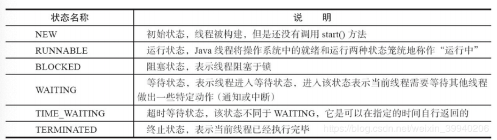
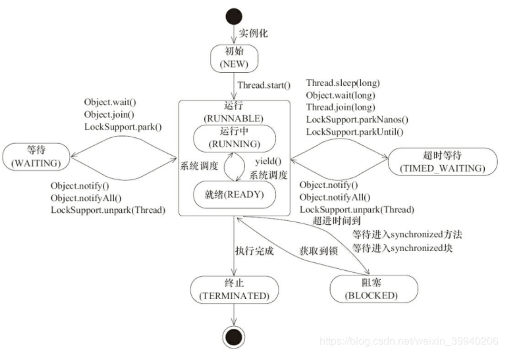
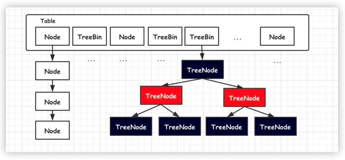
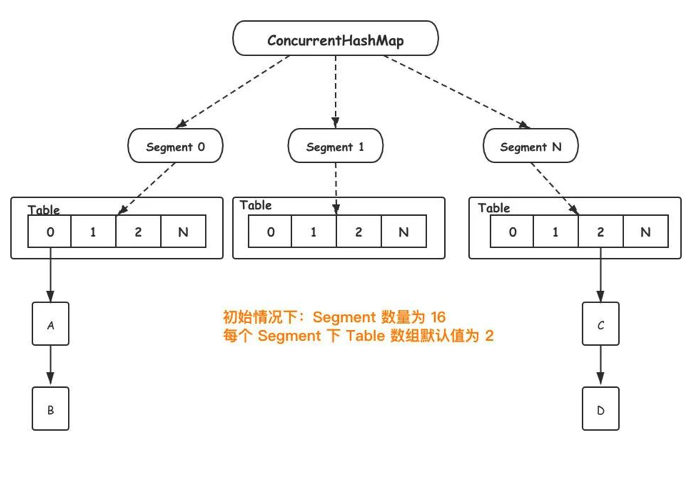
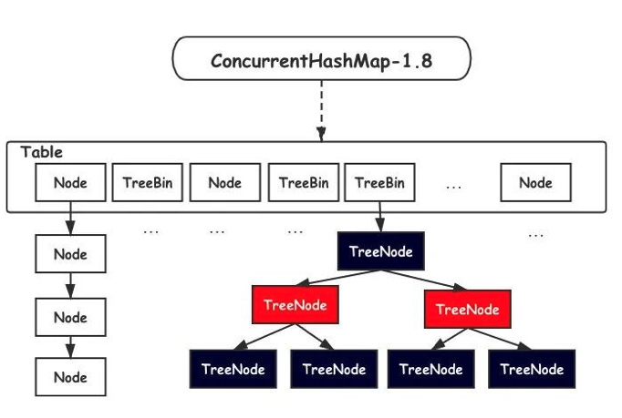
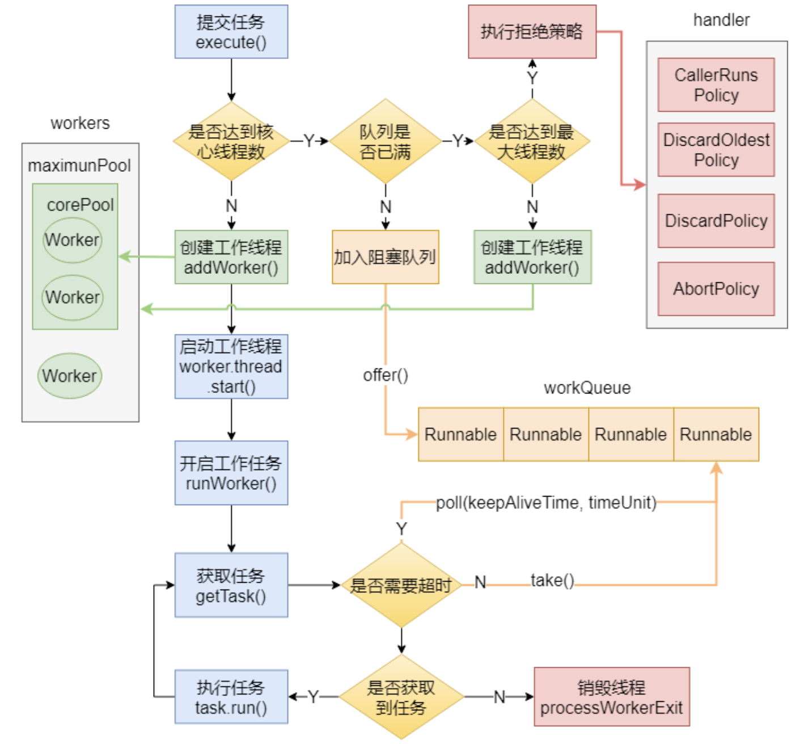
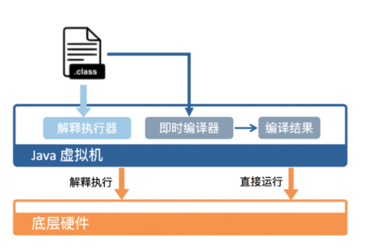
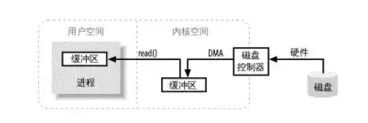
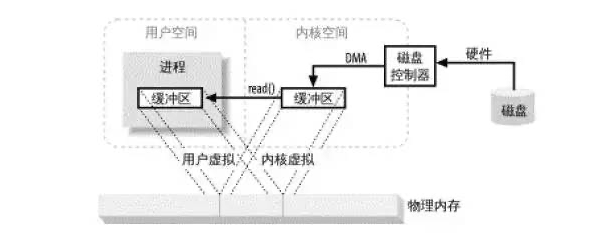

记录下来自己面试的一些问题和经验，期望以后能帮到别人。

[TOC]


# Java篇

### 谈谈你对Java平台的理解

说出Java的平台无关性，引出JVM虚拟机，JVM的好处和带来的内存管理问题，以及GC机制，Java内存结构

面向对象编程，从封装，继承，多态，反射，Java提供了丰富的类库，IO/NIO，网络，utils，更广阔的还有Java生态，广泛的应用场景。

### 八种基本数据类型的大小，以及他们的封装类


| 基本类型 | 大小（字节） | 默认值       | 封装类    |
| -------- | ------------ | ------------ | --------- |
| byte     | 1            | (byte)0      | Byte      |
| short    | 2            | (short)0     | Short     |
| int      | 4            | 0            | Integer   |
| long     | 8            | 0L           | Long      |
| float    | 4            | 0.0f         | Float     |
| double   | 8            | 0.0d         | Double    |
| boolean  | -            | false        | Boolean   |
| char     | 2            | \u0000(null) | Character |

   ### 重载和重写的区别

   **重写(Override)**

   从字面上看，重写就是 重新写一遍的意思。其实就是在子类中把父类本身有的方法重新写一遍。子类继承了父类原有的方法，但有时子类并不想原封不动的继承父类中的某个方法，所以在方法名，参数列表，返回类型(除过子类中方法的返回值是父类中方法返回值的子类时)都相同的情况下， 对方法体进行修改或重写，这就是重写。但要注意子类函数的访问修饰权限不能少于父类的。
   1.发生在父类与子类之间
   2.方法名，参数列表，返回类型（除过子类中方法的返回类型是父类中返回类型的子类）必须相同
   3.访问修饰符的限制一定要大于被重写方法的访问修饰符（public>protected>default>private)
   4.重写方法一定不能抛出新的检查异常或者比被重写方法申明更加宽泛的检查型异常

   **重载（Overload）**

   在一个类中，同名的方法如果有不同的参数列表（**参数类型不同、参数个数不同甚至是参数顺序不同**）则视为重载。同时，重载对返回类型没有要求，可以相同也可以不同，但**不能通过返回类型是否相同来判断重载**。 

   1.重载Overload是一个类中多态性的一种表现
   2.重载要求同名方法的参数列表不同(参数类型，参数个数甚至是参数顺序)
   3.重载的时候，返回值类型可以相同也可以不相同。无法以返回型别作为重载函数的区分标准 

   ### equals与==的区别

   == 比较的是变量(栈)内存中存放的对象的(堆)内存地址，用来判断两个对象的地址是否相同，即是否是指相同一个对象。比较的是真正意义上的指针操作。

   1、比较的是操作符两端的操作数是否是同一个对象。
   2、两边的操作数必须是同一类型的（可以是父子类之间）才能编译通过。
   3、比较的是地址，如果是具体的阿拉伯数字的比较，值相等则为true，如：
   int a=10 与 long b=10L 与 double c=10.0都是相同的（为true），因为他们都指向地址为10的堆。 

   **equals**：

   equals用来比较的是两个对象的内容是否相等，由于所有的类都是继承自java.lang.Object类的，所以适用于所有对象，如果没有对该方法进行覆盖的话，调用的仍然是Object类中的方法，而Object中的equals方法返回的却是==的判断。

   总结：

   所有比较是否相等时，都是用equals 并且在对常量相比较时，把常量写在前面，因为使用object的equals  object可能为null  则空指针，在阿里的代码规范中只使用equals ，阿里插件默认会识别，并可以快速修改，推荐安装阿里插件来排查老代码使用“==”，替换成equals

   ### String、String StringBuffer 和 StringBuilder 的区别是什么?  

   String是只读字符串，它并不是基本数据类型，而是一个对象。从底层源码来看是一个final类型的字符数组，所引用的字符串不能被改变，一经定义，无法再增删改。每次对String的操作都会生成新的String对象。

   ```java
   private final char value[];
   ```

   每次+操作 ： 隐式在堆上new了一个跟原字符串相同的StringBuilder对象，再调用append方法 拼接+后面的字符。

   StringBuffer和StringBuilder他们两都继承了AbstractStringBuilder抽象类，从AbstractStringBuilder抽象类中我们可以看到 

   ```java
char[] value;
   ```

他们的底层都是可变的字符数组，所以在进行频繁的字符串操作时，建议使用StringBuffer和StringBuilder来进行操作。 另外StringBuffer 对方法加了同步锁或者对调用的方法加了同步锁，所以是线程安全的。StringBuilder 并没有对方法进行加同步锁，所以是非线程安全的。 

   ### Hash冲突时的解决办法

   有可能.在产生hash冲突时,两个不相等的对象就会有相同的 hashcode 值.当hash冲突产生时,一般有以下几种方式来处理:

   - 拉链法:每个哈希表节点都有一个next指针,多个哈希表节点可以用next指针构成一个单向链表，被分配到同一个索引上的多个节点可以用这个单向链表进行存储.
   - 开放定址法:一旦发生了冲突,就去寻找下一个空的散列地址,只要散列表足够大,空的散列地址总能找到,并将记录存入
   - 再哈希:又叫双哈希法,有多个不同的Hash函数.当发生冲突时,使用第二个,第三个….等哈希函数计算地址,直到无冲突.

   ### Java创建对象有几种方式？

   java中提供了以下四种创建对象的方式:

   - new创建新对象
   - 通过反射机制
   - 采用clone机制
   - 通过序列化机制

   ### 泛型常用特点 

   泛型是Java SE 1.5之后的特性， 《Java 核心技术》中对泛型的定义是： 

   > “泛型” 意味着编写的代码可以被不同类型的对象所重用。 

“泛型”，顾名思义，“泛指的类型”。我们提供了泛指的概念，但具体执行的时候却可以有具体的规则来约束，比如我们用的非常多的ArrayList就是个泛型类，ArrayList作为集合可以存放各种元素，如Integer, String，自定义的各种类型等，但在我们使用的时候通过具体的规则来约束，如我们可以约束集合中只存放Integer类型的元素，如 

   ```java
   List<Integer> iniData = new ArrayList<>()
   ```

  使用泛型的好处？

以集合来举例，使用泛型的好处是我们不必因为添加元素类型的不同而定义不同类型的集合，如整型集合类，浮点型集合类，字符串集合类，我们可以定义一个集合来存放整型、浮点型，字符串型数据，而这并不是最重要的，因为我们只要把底层存储设置了Object即可，添加的数据全部都可向上转型为Object。 更重要的是我们可以通过规则按照自己的想法控制存储的数据类型。 

   ### 深拷贝和浅拷贝的区别是什么?

   - 浅拷贝:被复制对象的所有变量都含有与原来的对象相同的值,而所有的对其他对象的引用仍然指向原来的对象.换言之,浅拷贝仅仅复制所考虑的对象,而不复制它所引用的对象.
   - 深拷贝:被复制对象的所有变量都含有与原来的对象相同的值.而那些引用其他对象的变量将指向被复制过的新对象.而不再是原有的那些被引用的对象.换言之.深拷贝把要复制的对象所引用的对象都复制了一遍.

   ### a=a+b与a+=b有什么区别吗?

    `+=`操作符会进行隐式自动类型转换,此处a+=b隐式的将加操作的结果类型强制转换为持有结果的类型,而a=a+b则不会自动进行类型转换.如： 

   ```java
   byte a = 127;
   byte b = 127;
   b = a + b; // 报编译错误:cannot convert from int to byte
   b += a; 
   ```

   以下代码是否有错,有的话怎么改？

   ```java
   short s1= 1;
   s1 = s1 + 1;
   ```

    有错误.short类型在进行运算时会自动提升为int类型,也就是说`s1+1`的运算结果是int类型,而s1是short类型,此时编译器会报错. 

   正确写法：

   ```java
   short s1= 1; 
   s1 += 1; 
   ```

+=操作符会对右边的表达式结果强转匹配左边的数据类型,所以没错. 


   ### Java 序列化中如果有些字段不想进行序列化，怎么办？

   对于不想进行序列化的变量，使用 transient 关键字修饰。

   transient 关键字的作用是：阻止实例中那些用此关键字修饰的的变量序列化；当对象被反序列化时，被 transient 修饰的变量值不会被持久化和恢复。transient 只能修饰变量，不能修饰类和方法。

### 线程有哪些基本状态?





当线程执行 `wait()`方法之后，线程进入 **WAITING（等待）**状态。进入等待状态的线程需要依靠其他线程的通知才能够返回到运行状态，而 TIME_WAITING(超时等待) 状态相当于在等待状态的基础上增加了超时限制，比如通过 `sleep（long millis）`方法或 `wait（long millis）`方法可以将 Java 线程置于 TIMED WAITING 状态。当超时时间到达后 Java 线程将会返回到 RUNNABLE 状态。当线程调用同步方法时，在没有获取到锁的情况下，线程将会进入到 BLOCKED（阻塞） 状态。线程在执行 Runnable 的`run()`方法之后将会进入到 TERMINATED（终止） 状态。 

### Java反射的原理与作用

### 你有没有遇到过OutOfMemory问题？你是怎么来处理这个问题的？处理 过程中有哪些收获？

## 集合类

### hashmap的数据结构和死锁的生成

HashMap 是我们经常会用到的集合类，JDK 1.7 之前底层使用了数组加链表的组合结构，新添加的元素通过取模的方式，定位 Table 数组位置，然后将元素加入链表头部，这样下次提取时就可以快速被访问到。访问数据时，也是通过取模的方式，定位数组中的位置，然后再遍历链表，依次比较，获取相应的元素。

如果 HasMap 中元素过多时，可能导致某个位置上链表很长。原本 O(1) 查找性能，可能就退化成 O(N),严重降低查找效率。为了避免这种情况，当 HasMap 元素数量满足以下条件时，将会自动扩容,重新分配元素。

```
// size:HashMap 中实际元素数量
//capacity：HashMap 容量，即 Table 数组长度，默认为：16
//loadFactor：负载因子，默认为：0.75
size>=capacity*loadFactor
```

HasMap 将会把容量扩充为原来的两倍，然后将原数组元素迁移至新数组。

 旧数组元素迁移到新数组时，依旧采用『头插入法』，这样将会导致新链表元素的逆序排序。

多线程并发扩容的情况下，链表可能形成死链（环形链表）。一旦有任何查找元素的动作，线程将会陷入死循环,从而引发 CPU 使用率飙升。

***\*1. JDK1.8 改进方案\****

JDK1.8 HashMap 底层结构进行彻底重构，使用数组加链表/红黑树方式这种组合结构。



新元素依旧通过取模方式获取 Table 数组位置，然后再将元素加入链表尾部。一旦链表元素数量超过 8 之后，自动转为红黑树，进一步提高了查找效率。

由于 JDK1.8 链表采用『尾插入』法，从而避免并发扩容情况下链表形成死链的可能。

### **SynchronizedMap**和**ConcurrentHashMap**

对于并发的情况，我们可以使用 JDK 提供 SynchronizedMap 保证安全。

SynchronizedMap 是一个内部类，只能通过以下方式创建实例。

Map m = Collections.synchronizedMap(**new** HashMap(...));

每个方法内将会使用 synchronized 关键字加锁，从而保证并发安全。

由于多线程共享同一把锁，导致同一时间只允许一个线程读写操作，其他线程必须等待，极大降低的性能。

并且大多数业务场景都是读多写少，多线程读操作本身并不冲突，SynchronizedMap 极大的限制读的性能。

所以多线程并发场景我们很少使用 SynchronizedMap。

**ConcurrentHashMap**

既然多线程共享一把锁，导致性能下降。那么设想一下我们是不是多搞几把锁，分流线程，减少锁冲突，提高并发度。

ConcurrentHashMap 正是使用这种方法，不但保证并发过程数据安全，又保证一定的效率。

**1. JDK1.7**

JDK1.7  ConcurrentHashMap 数据结构如下所示:



Segament 是一个ConcurrentHashMap内部类，底层结构与 HashMap 一致。另外Segament 继承自 ReentrantLock

当新元素加入 ConcurrentHashMap 时，首先根据 key hash 值找到相应的 Segament。接着直接对 Segament 上锁，若获取成功，后续操作步骤如同 HashMap。

由于锁的存在，Segament 内部操作都是并发安全，同时由于其他 Segament 未被占用，因此可以支持 concurrencyLevel 个线程安全的并发读写。

***\*size 统计问题\****

虽然 ConcurrentHashMap 引入分段锁解决多线程并发的问题，但是同时引入新的复杂度，导致计算 ConcurrentHashMap 元素数量将会变得复杂。

由于 ConcurrentHashMap 元素实际分布在 Segament 中，为了统计实际数量，只能遍历 Segament 数组求和。

为了数据的准确性，这个过程过我们需要锁住所有的 Segament，计算结束之后，再依次解锁。不过这样做，将会导致写操作被阻塞，一定程度降低 ConcurrentHashMap 性能。

所以这里对 ConcurrentHashMap#size 统计方法进行一定的优化。

Segment 每次被修改（写入，删除）,都会对 modCount（更新次数）加 1。只要相邻两次计算获取所有的 Segment modCount 总和一致，则代表两次计算过程并无写入或删除，可以直接返回统计数量。

如果三次计算结果都不一致，那没办法只能对所有 Segment 加锁，重新计算结果。

这里需要注意的是，这里求得 size 数量不能做到 100% 准确。这是因为最后依次对 Segment 解锁后，可能会有其他线程进入写入操作。这样就导致返回时的数量与实际数不一致。

不过这也能被接受，总不能因为为了统计元素停止所有元素的写入操作。

***\*性能问题\****

想象一种极端情况的，所有写入都落在同一个 Segment中，这就导致ConcurrentHashMap 退化成 SynchronizedMap，共同抢一把锁。

***\*2. JDK1.8 改进方案\****

JDK1.8 之后，ConcurrentHashMap 取消了分段锁的设计，进一步减少锁冲突的发生。另外也引入红黑树的结构，进一步提高查找效率。

数据结构如下所示：



Table 数组的中每一个 Node 我们都可以看做一把锁，这就避免了 Segament 退化问题。

另外一旦 ConcurrentHashMap 扩容， Table 数组元素变多，锁的数量也会变多，并发度也会提高。

总的来说，JDK1.8 使用 CAS 方法加 synchronized 方式，保证并发安全。

ConcurrentHashMap 通过使用分段锁的设计方式，降低锁的粒度，提高并发度。我们可以借鉴这种设计，解决某些热点数据更新问题。

SynchronizedMap 虽然线程安全，但是由于锁粒度太大，导致性能太低，所以也不太适合在多线程使用。

ConcurrentHashMap 由于使用多把锁，充分降低多线程并发竞争的概率，提高了并发度，非常适合在多线程中使用。

### Hashmap为什么这里使用红黑树？而不是其他二叉树呢？


我们知道 Java 的对象都是引用类型,如果是一个原始数据类型数组,它在内存里是一段连续的内存,而对象数组则不然,数据存储的是引用,对象往往是分散地存储在堆的不同位置。这种设计虽然带来了极大灵活性,但是也导致了数据操作的低效,尤其是无法充分利用现代 CPU 缓存机制。


### volatile关键字

volatile关键字,具有两个特性: 1.内存的可见性, 2.禁止指令重排序优化。

内存可见性是指:被volatile关键爬修饰的变量,当线程要对这个变量执行的写操作,都不会写入本地缓存,而是直接刷入主内存中。当线程读取被volatile关键字修饰的变量时,也是直接从主内存中读取。(简单的说,一个线程修改的状态对另一个线程是可见的) 。

**注意: volatile不能保证原子性。**

禁止指令重排序优化:有volatile修饰的变量,赋值后多执行了一个"load addl $Oxo,(%esp)"操作,这个操作相当于一个内存屏障,保证指令重排序时不会把后面的指令重排序到内存屏障之前的位置。

## 多线程

### 为什么要使用线程池

合理的使用线程池，则可以避免把系统搞崩的窘境。总得来说，使用线程池可以带来以下几个好处：

1. 降低资源消耗。通过重复利用已创建的线程，降低线程创建和销毁造成的消耗。
2. 提高响应速度。当任务到达时，任务可以不需要等到线程创建就能立即执行。
3. 增加线程的可管理型。线程是稀缺资源，使用线程池可以进行统一分配，调优和监控。


### 线程池的运作流程



### 线程池目前有5个状态：

- RUNNING：接受新任务并处理排队的任务。
- SHUTDOWN：不接受新任务，但处理排队的任务。
- STOP：不接受新任务，不处理排队的任务，并中断正在进行的任务。
- TIDYING：所有任务都已终止，workerCount 为零，线程转换到 TIDYING 状态将运行 terminated() 钩子方法。
- TERMINATED：terminated() 已完成。


### 线程池有哪些拒绝策略？

常见的有以下几种：

AbortPolicy：中止策略。默认的拒绝策略，直接抛出 RejectedExecutionException。调用者可以捕获这个异常，然后根据需求编写自己的处理代码。

DiscardPolicy：抛弃策略。什么都不做，直接抛弃被拒绝的任务。

DiscardOldestPolicy：抛弃最老策略。抛弃阻塞队列中最老的任务，相当于就是队列中下一个将要被执行的任务，然后重新提交被拒绝的任务。如果阻塞队列是一个优先队列，那么“抛弃最旧的”策略将导致抛弃优先级最高的任务，因此最好不要将该策略和优先级队列放在一起使用。

CallerRunsPolicy：调用者运行策略。在调用者线程中执行该任务。该策略实现了一种调节机制，该策略既不会抛弃任务，也不会抛出异常，而是将任务回退到调用者（调用线程池执行任务的主线程），由于执行任务需要一定时间，因此主线程至少在一段时间内不能提交任务，从而使得线程池有时间来处理完正在执行的任务。

### 在我们实际使用中，线程池的大小配置多少合适？

要想合理的配置线程池大小，首先我们需要区分任务是计算密集型还是I/O密集型。

对于计算密集型，设置 线程数 = CPU数 + 1，通常能实现最优的利用率。

对于I/O密集型，网上常见的说法是设置 线程数 = CPU数 * 2 ，这个做法是可以的，但个人觉得不是最优的。

在我们日常的开发中，我们的任务几乎是离不开I/O的，常见的网络I/O（RPC调用）、磁盘I/O（数据库操作），并且I/O的等待时间通常会占整个任务处理时间的很大一部分，在这种情况下，开启更多的线程可以让 CPU 得到更充分的使用，一个较合理的计算公式如下：

线程数 = CPU数 * CPU利用率 * (任务等待时间 / 任务计算时间 + 1)

例如我们有个定时任务，部署在4核的服务器上，该任务有100ms在计算，900ms在I/O等待，则线程数约为：4 * 1 * (1 + 900 / 100) = 40个。

### 解释执行和编译执行

解释执行：执行时逐条将字节码编译成机器码并执行，无需保存不占内存。

即时编译：将一个方法中包含的所有字节码编译成机器码后再执行，编译后的指令保存在内存中，比较占用内存，适合二八模式，热点代码用即时编译



为了满足不同用户场景的需要,HotSpot内置了多个即时编译器:C1,C2和Graal

之所以引入多个即时编译器,是为了在编译时间和生成代码的执行效率之间进行取舍。C1又叫做Client编译器,面向的是对启动性能有要求的客户端GUI程序,采用的优化手段相对简单,因此编译时间较短。

C2又叫做Server编译器,面向的是对峰值性能有要求的服务器端程序,采用优化手段相对复杂,因此编译时间较长,但同时生成代码的执行效率较高。

从Java 7开始,HotSpot默认采用分层编译的方式:热点方法首先会被C1编译,而后热点方法中的热点会进一步被C2编译


### Netty，Kafka中的零拷贝技术

Java 进程发起 Read 请求加载数据大致的流程图：



进程发起 Read 请求之后，内核接收到 Read 请求之后，会先检查内核空间中是否已经存在进程所需要的数据，如果已经存在，则直接把数据 Copy 给进程的缓冲区。如果没有内核随即向磁盘控制器发出命令，要求从磁盘读取数据，磁盘控制器把数据直接写入内核 Read 缓冲区，这一步通过 DMA 完成。

接下来就是内核将数据 Copy 到进程的缓冲区；如果进程发起 Write 请求，同样需要把用户缓冲区里面的数据 Copy 到内核的 Socket 缓冲区里面，然后再通过 DMA 把数据 Copy 到网卡中，发送出去。

- 零拷贝机制可以减少数据在内核缓冲区和用户进程缓冲区之间反复的 I/O 拷贝操作。
- 零拷贝机制可以减少用户进程地址空间和内核地址空间之间因为上下文切换而带来的 CPU 开销。

现代操作系统都使用虚拟内存，使用虚拟的地址取代物理地址，这样做的好处是：

- 一个以上的虚拟地址可以指向同一个物理内存地址。
- 虚拟内存空间可大于实际可用的物理地址。

利用第一条特性可以把内核空间地址和用户空间的虚拟地址映射到同一个物理地址，这样 DMA 就可以填充对内核和用户空间进程同时可见的缓冲区了。省去了内核与用户空间的往来拷贝



在 Linux 中零拷贝技术主要有 3 个实现思路：用户态直接 I/O、减少数据拷贝次数以及写时复制技术。

- 用户态直接 I/O：应用程序可以直接访问硬件存储，操作系统内核只是辅助数据传输。这种方式依旧存在用户空间和内核空间的上下文切换，硬件上的数据直接拷贝至了用户空间，不经过内核空间。因此，直接 I/O 不存在内核空间缓冲区和用户空间缓冲区之间的数据拷贝。
- 减少数据拷贝次数：在数据传输过程中，避免数据在用户空间缓冲区和系统内核空间缓冲区之间的CPU拷贝，以及数据在系统内核空间内的CPU拷贝，这也是当前主流零拷贝技术的实现思路。
- 写时复制技术：写时复制指的是当多个进程共享同一块数据时，如果其中一个进程需要对这份数据进行修改，那么将其拷贝到自己的进程地址空间中，如果只是数据读取操作则不需要进行拷贝操作。

RocketMQ 选择了 mmap + write 这种零拷贝方式，适用于业务级消息这种小块文件的数据持久化和传输；而 Kafka 采用的是 sendfile 这种零拷贝方式，适用于系统日志消息这种高吞吐量的大块文件的数据持久化和传输。但是值得注意的一点是，Kafka 的索引文件使用的是 mmap + write 方式，数据文件使用的是 sendfile 方式。


链接：https://juejin.im/post/6844903949359644680


- kafka节点之间如何复制备份的？
- kafka消息是否会丢失？为什么？
- kafka最合理的配置是什么？
- kafka的leader选举机制是什么？
- kafka对硬件的配置有什么要求？
- kafka的消息保证有几种方式？
- kafka为什么会丢消息？